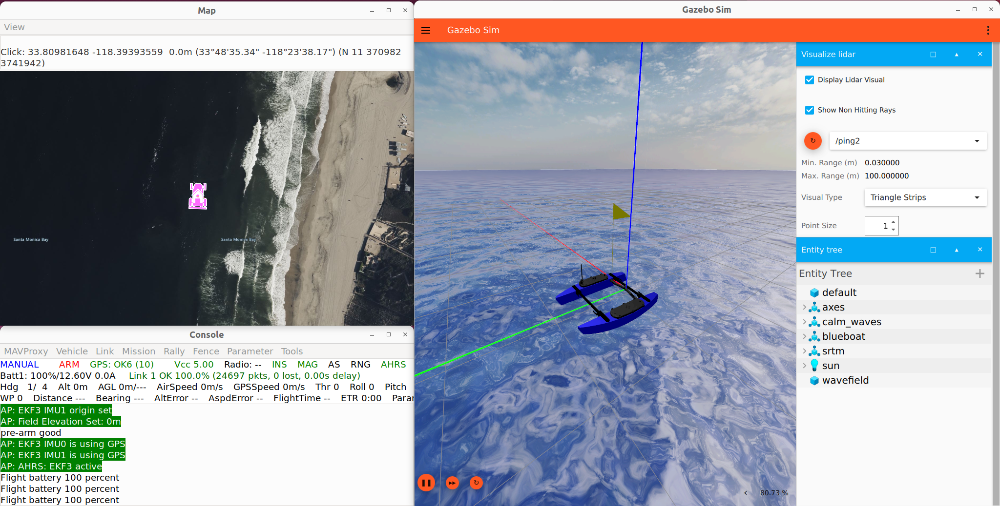

<p align="center">
  
  
</p>


# docker-sgp-tools

**docker-sgp-tools** provides ready-to-use [Docker Compose](https://docs.docker.com/compose/) files and Dockerfiles for running [SGP-Tools](https://sgp-tools.com/) and its [ROS2](https://github.com/itskalvik/ros_sgp_tools) companion package in two main scenarios:

- **Simulation**: Full-stack GUI container (Gazebo, ArduPilot SITL, ROS2, Foxglove, SGP-Tools).
- **Robot/Edge/BlueOS**: Minimal ROS2/SGP-Tools container, usable directly on a robot or as a [BlueOS](https://bluerobotics.com/blueos-conversion/) extension.

## Containers & Compose Files
| Compose File          | Use Case            | Features                                                                                 |
|-----------------------|---------------------|------------------------------------------------------------------------------------------|
| `sim-compose.yml`     | Simulation/Dev      | GUI, ROS2, Gazebo, ArduPilot SITL, SGP-Tools, Foxglove. Requires Nvidia GPU.             |
| `robot-compose.yml`   | Robot/Production    | Minimal ROS2/SGP-Tools. Runs on robot or deployable as a BlueOS extension.  |

### Prerequisites

- [Docker Engine](https://docs.docker.com/engine/install/)
- [Docker Compose](https://docs.docker.com/compose/install/)
- [NVIDIA Container Toolkit](https://docs.nvidia.com/datacenter/cloud-native/container-toolkit/latest/install-guide.html) (for GPU support in simulation)
- **Optional for multi-arch builds**: [Buildx](https://docs.docker.com/buildx/working-with-buildx/)

## Getting Started 

### 1. Clone this repository

```bash
git clone --recurse-submodules https://github.com/itskalvik/docker-sgp-tools.git
cd docker-sgp-tools
```

### 2. Pull and Run the Simulation Container

```bash
docker compose -f sim-compose.yml pull
docker compose -f sim-compose.yml up -d
docker compose -f sim-compose.yml exec sgptools bash
```

#### To stop or clean up:

```bash
docker compose -f sim-compose.yml stop    # stop containers, keep data/volumes
docker compose -f sim-compose.yml down    # stop and remove containers/volumes/networks/images
```

### 3. Run the Minimal Robot Container
For **robot deployment** onboard a custom ASV:

```bash
docker compose -f robot-compose.yml up -d
docker compose -f robot-compose.yml exec sgptools bash
```

* The `robot-compose.yml` file can be customized for device paths, data log locations, and environment variables as needed.

* See the [BlueOS SGP-Tools README](./robot-docker/README.md) for step-by-step instructions on deploying as a BlueOS extension on a Blue Robotics Blue Boat.

## Simulation Workflow Example




### 1. Launch Gazebo simulation with BlueBoat ASV:

```
gz sim -v4 -r blueboat_waves.sdf
```

#### 2. Start ArduPilot SITL (inside container):

```
sim_vehicle.py -v Rover -f rover-skid --model JSON --console --map -N -L RATBeach
```

* Wait for `AHRS` and `GPS` to turn green in MAVProxy.

* If errors (`paramftp: bad count`), restart sim_vehicle.py.

#### 3. Launch SGP-Tools planner:

```
ros2 launch ros_sgp_tools asv.launch.py
```

#### 4. (Optional) Visualize in Foxglove:

* Open Foxglove web (https://app.foxglove.dev/)
* Connect to ROS2 bridge at `ws://localhost:8765`

## About the Images

* **Simulation container:**

    * Ubuntu, ROS2 Humble, Gazebo, MAVProxy, ArduPilot SITL, Foxglove bridge, SGP-Tools, all required plugins and environment scripts.

    * Includes ros_entrypoint_sitl.sh to automatically set up Gazebo/ArduPilot/ROS2 plugin paths on container start.

    * NVIDIA GPU required for Gazebo reliability.

* **Robot container:**

    * Lightweight image: ROS2, SGP-Tools, minimal ROS2 nodes, sensor drivers.

    * Designed for ARM64 and AMD64 targets (supports BlueOS and bare-metal robot computers).

## Building from Scratch (Multi-Arch)

To build containers for both ARM64 and AMD64:

```bash
docker buildx create --name multi-arch --platform "linux/arm64,linux/amd64" --driver "docker-container"
docker buildx use multi-arch

docker compose -f sim-compose.yml build
# or
docker compose -f robot-compose.yml build

```

## Robot/BlueOS Extension

* The **robot container** can be deployed as a BlueOS extension on compatible vehicles (e.g., BlueRobotics BlueBoat).

* **See the** [BlueOS SGP-Tools README](./robot-docker/README.md) for detailed instructions, swap size configuration, file upload, and mission launch procedures.

## References
- Based on Dockerfiles from:
    - https://github.com/Robotic-Decision-Making-Lab/blue
    - https://github.com/ryomo/ros2-gazebo-docker
