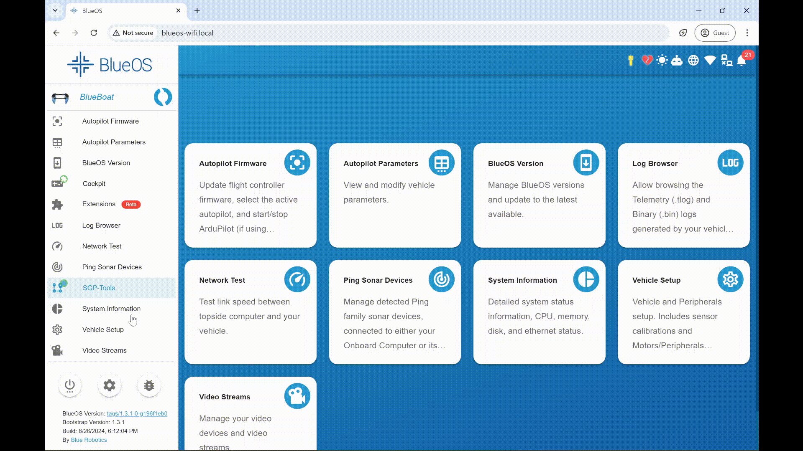

# [BlueOS SGP-Tools](https://github.com/itskalvik/docker-sgp-tools/tree/main/robot-docker)
A BlueOS Extension for Autonomous Approximate Bathymetric Surveys

## What Does It Do?
Autonomous Surface Vehicles (ASVs), such as the [BlueRobotics BlueBoat](https://bluerobotics.com/store/boat/blueboat/blueboat/), are well-suited for bathymetric surveys. However, it is often the case that an exhaustive survey mapping the depth at every location in an area is infeasible or unnecessary. In such cases, we can leverage variations in the underwater terrain to determine a few critical locations for data collection, which would result in a good approximation of the area's bathymetry.

The [SGP-Tools python library](https://www.itskalvik.com/sgp-tools) provides path planners to address the above problem, known as the informative path planning problem. The BlueOS SGP-Tools extension uses this library to determine ideal locations for the ASV to collect data and controls the ASV to autonomously visit the selected locations.

The following shows the path planner adaptively planning paths for four robots tasked with surveying a given area:
<div style="text-align:left">
<p><a href="http://itskalvik.com/sgp-tools">

</a></p>
</div>

## Usage
1. First, we need to define the survey area and the robot launch location. The extension can read this data from [QGC plan files](https://docs.qgroundcontrol.com/Stable_V4.3/en/qgc-user-guide/plan_view/plan_geofence.html). The survey area and launch position must be defined using a **polygon-shaped** geofence drawn in [QGC](https://qgroundcontrol.com/) and saved as ```mission.plan```.

    <div style="text-align:left">
    
    </a></p>
    </div>

2. Once you have the plan file, copy it to the robot using the ```File Browser``` feature in BlueOS's [```Pirate Mode```](https://blueos.cloud/docs/1.0/usage/advanced/). The ```mission.plan``` file should be uploaded to the following directory: ```/extensions/sgptools/```

    Once the ```mission.plan``` file is uploaded, restart the extension to ensure that the new file is used for the mission.

    <div style="text-align:left">
    
    </a></p>
    </div>

3. Finally, use the terminal provided by the SGP-Tools extension to start the mission with the following command:
    ```
    ros2 launch ros_sgp_tools single_robot.launch.py
    ```

    <div style="text-align:left">
    
    </a></p>
    </div>

4. Use the following commands in the SGP-Tools extension's terminal to record the robot position and sonar data during the mission. Please refer to [rosbag2](https://github.com/ros2/rosbag2) for more details. 

    ```
    cd $DATA_FOLDER
    ros2 bag record -a
    ```

## Parameters
You can control the following extension parameters using environment variables that can be configured from the BlueOS's extensions panel

* ```PING2_PORT``` (```default: /dev/ttyUSB0```): Specifies the device to which the Ping2 sonar is mounted. 
* ```NUM_WAYPOINTS``` (```default: 20```): The number of waypoints optimized by the path planner. Increasing the number of waypoints gives a more complex path which potentally covers a larger area but also requires more compute and could result in slower online path updates. 
* ```SAMPLING_RATE``` (```default: 2```): The number of points to sample along each edge of the path during path planning. Increasing the samping rate results in the planner being aware of the data being collected along the whole path instead of assuming that the data is collected only at the vertices. This method requires relatively less compute then increasing the number of waypints, but still adds to the overall compute cost.
* ```START_FOXGLOVE``` (```default: False```): Enables [foxglove](https://foxglove.dev/product), a web-based data visualization platform similar to [RViz](https://docs.ros.org/en/humble/Tutorials/Intermediate/RViz/RViz-User-Guide/RViz-User-Guide.html). You can access it from the [web app](https://app.foxglove.dev/). Use the ```open connection``` feature and change the address from ```localhost``` to the ip address of the ASV.
* ```ADAPTIVE_IPP``` (```default: True```): Enables adaptive IPP, which uses the data streaming from the sonar to learn the correlations in the underwater bathymetry and further optimizes the future waypoints to maximize collecting new informative data.
* ```NAMESPACE``` (```default: robot_0```): ROS2 namespace, useful when multiple ROS2 robots are operating on the same network.
* ```DATA_TYPE``` (```default: Ping2```): Type of sensor to be used by the path planner. Currently, only the [BlueRobotics Ping Sonar](https://bluerobotics.com/store/sonars/echosounders/ping-sonar-r2-rp/) is supported.

## Hardware Configuration:
- This extension works only on 64-bit operating systems. You can install the latest version of [BlueOS](https://github.com/bluerobotics/BlueOS) on [64-bit Raspberry Pi OS Lite](https://www.raspberrypi.com/software/operating-systems/) by running the following command on the Pi (ensure the username is set to ```pi```):
    ```
    sudo su -c 'curl -fsSL https://raw.githubusercontent.com/bluerobotics/blueos-docker/master/install/install.sh | bash'
    ```

- The extension requires over 4GB of memory+swap. Please ensure that the swap size is large enough to accommodate the extension. The extension will copy the shell script ```config_swap.sh``` to ```/usr/blueos/extensions/sgptools/``` folder on the underlying device. You can use this script to increase the swap size before starting the path planner. 

    You will have to use [```Pirate Mode```](https://blueos.cloud/docs/1.0/usage/advanced/) to access BlueOS's built-in terminal and run the script on the underlying device via the ```red-pill``` utility. Use the following commands to enable ```red-pill``` and increase the swap size: 
    ```
    red-pill
    sudo bash /usr/blueos/extensions/sgptools/config_swap.sh
    ```

    <div style="text-align:left">
    
    </a></p>
    </div>

## Disclaimer ⚠️
This extension, when executed properly, will take control of the ASV and could potentially collide the vehicle with obstacles in the environment. Please use it with caution.